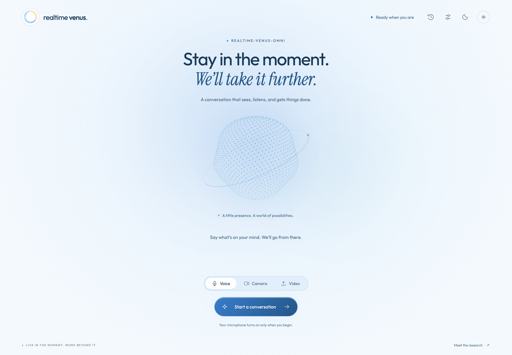

# Realtime-Venus Demo

**English** · [简体中文](README_ZH.md) · [Project overview](../README.md) · [Harness](../harness/README.md)

Browser demo with Realtime-Venus-Omni and a Codex-backed Harness. Voice, camera, and video modes use the Omni checkpoint.

## Two loops, one conversation

<p align="center"><br /><sub>Figure 3 from the <a href="https://arxiv.org/html/2609.13814v1#S3.F3">paper</a>. The demo instantiates the frontend with Realtime-Venus-Omni.</sub></p>

Omni handles streaming media and speech in the **interaction loop**. In the **capability loop**, Harness executes `<delegate>...</delegate>` requests asynchronously and returns results through `<backend>...</backend>` for Omni to speak.

## Service layout

| Component | Responsibility | Implementation |
| --- | --- | --- |
| Browser | Capture devices or upload a video, stream input, play speech, show task progress and downloads. | [`static/app.js`](static/app.js) |
| Web service · 8032 | Accept HTTP/WebSocket requests, own the browser session, and assemble model and Harness connections. | [`server/app.py`](server/app.py), [`server/resources.py`](server/resources.py) |
| Session host | Order media input, consume model output, schedule private feedback, and relay playback acknowledgments. | [`server/session.py`](server/session.py), [`VenusOmniServingHost`](../harness/bridge/host.py) |
| Model service · 8031 | Load the checkpoint, retain model state, run streaming inference, and generate native speech. | [`model/server.py`](model/server.py), [`model/adapter.py`](model/adapter.py) |
| Harness + Codex | Embedded task execution, progress, and result delivery. | [`server/resources.py`](server/resources.py), [Harness](../harness/README.md#architecture) |
| Launcher and settings | Installation, process management, and saved configuration. | [`launcher/`](launcher/), [`install.py`](install.py), [`settings.py`](settings.py) |

<p align="center"><br /><sub>The browser is the entry point for live media, task progress, and result downloads.</sub></p>

## Prepare

Use a Linux server with an NVIDIA CUDA GPU and a working driver. Download the complete, merged Omni checkpoint from the [release links](../README.md), retaining its model code, tokenizer, reference audio, and speech assets. Place it in `model_weight/`.

The Codex backend requires network access and a usable login. The installer reuses an existing Codex installation or installs it; first startup guides login when needed.

<details>
<summary>Expected checkpoint layout</summary>

```text
model_weight/
├── config.json
├── tokenizer.json / tokenizer_config.json
├── *.py                       # Checkpoint model code
├── model.safetensors          # Or all shards and their index JSON
└── assets/
    ├── HT_ref_audio.wav
    └── token2wav/
        ├── flow.yaml / flow.pt / hift.pt
        ├── campplus.onnx
        └── speech_tokenizer_v2_25hz.onnx
```

A nested `model_weight/model_weight/` layout is also recognized.

</details>

## Start

From the **repository root**, with the checkpoint in its default location:

```bash
bash install.sh
bash start.sh
```

The installer creates an isolated Python 3.11/3.12 environment. The launcher checks assets, CUDA, and Codex, then starts the model API on **8031** and web service on **8032**.

If your weights are elsewhere, use their existing path:

```bash
bash start.sh --model-path /srv/models/Realtime-Venus-Omni
```

To change the reference voice, add `--ref-audio /srv/voices/reference.wav`. The default is `assets/HT_ref_audio.wav` in the checkpoint directory.

## Open on your computer

In a terminal **on your local computer**, keep this tunnel open, substituting your SSH login:

```bash
ssh -N -L 8032:127.0.0.1:8032 user@server
```

Open **[http://localhost:8032](http://localhost:8032)** and start a conversation.

| Input mode | What to do |
| --- | --- |
| **Voice** | Allow microphone access and listen through your local speakers. |
| **Camera** | Share the camera and microphone together; the page shows a live preview. |
| **Video** | Choose Video and upload a local file, up to **200 MB**. Its soundtrack and sampled frames are streamed to the model. |

The side panel provides task progress, cancellation, and artifact downloads.

The service supports **one active conversation**. It listens on loopback by default; SSH forwarding provides a browser-trusted `localhost` origin. Direct access through a server IP requires HTTPS for camera/microphone permissions. If the server web port is changed to `9032`, forward with `-L 8032:127.0.0.1:9032` instead.

## Configuration

### Server settings

To keep a custom setup, run `cp config.example.json config.json` at the repository root and edit the copy:

```json
{
  "model_path": "/srv/models/Realtime-Venus-Omni",
  "reference_audio": "",
  "model_port": 8031,
  "web_port": 8032,
  "web_host": "127.0.0.1",
  "memory_minutes": 40
}
```

Replace the example model path with your own. An empty `reference_audio` selects the checkpoint's default WAV. Relative paths resolve from the repository root; changes to these settings require a service restart.

Precedence is **CLI → environment → `config.json` → defaults**. The corresponding environment variables are `MODEL_PATH`, `REF_AUDIO`, `VENUS_MODEL_PORT`, `VENUS_WEB_PORT`, `VENUS_WEB_HOST`, and `VENUS_MEMORY_MINUTES`.

### Browser settings

End the current conversation before saving settings. Model and task options persist in `runtime/harness.json` and apply to the next session.

| Setting | Default | Effect |
| --- | --- | --- |
| **Task mode** | General | Sends each delegate straight to the task agent, without a routing model call. Select Auto for automatic capability selection and task continuation. |
| **Task execution** | Server model, `low` effort | Controls the background worker. |
| **Auto routing** | Task model, `low`, 30 seconds | Used only in Auto mode. A timeout ends the routing request without launching its worker. |
| **Progress/result summaries** | Task model, `low` | Controls result preparation, including direct answers and image understanding. |
| **Speaking length** | `length_penalty = 0.8` | Values below 1 encourage earlier turn endings; 1 preserves the original behavior; values above 1 encourage longer turns. Range: 0.1–5. |

Blank routing/summary model names inherit the task model, then the server default. Settings also include devices and background-task language.

## Service management

```bash
bash start.sh --check --no-login  # Preflight while this checkout's services are stopped
bash start.sh --detach           # Start in the background; return when ready
bash start.sh --status
bash start.sh --stop
```

Use the same model/reference options with `--check` and `--detach`, or save them in `config.json`. `--no-login` reports missing authentication without starting login. For a foreground launch, Ctrl+C stops both services.

| Runtime location | Contents |
| --- | --- |
| `runtime/logs/model.log` | Model loading and inference. |
| `runtime/logs/web.log` | Browser connections, uploads, and session errors. |
| `runtime/logs/stack.log` | Detached startup and supervision. |
| `runtime/harness.json` | Saved model/task preferences and workspace selection. |
| `runtime/workspace/` | Default task workspace. Generated files remain after a session; browser download links are session-scoped. |
