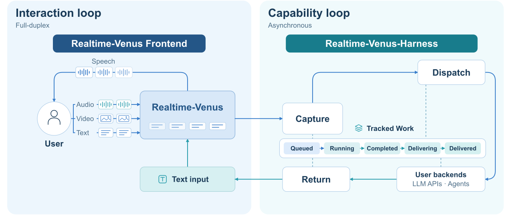
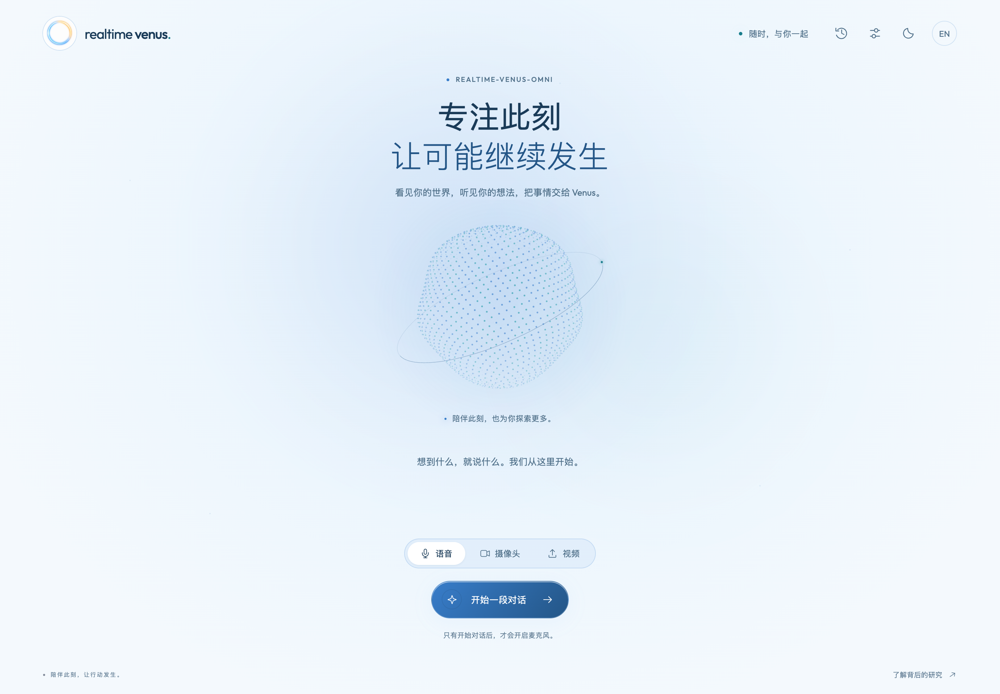

# Realtime-Venus Demo

[English](README.md) · **简体中文** · [项目总览](../README_ZH.md) · [Harness](../harness/README_ZH.md)

基于 Realtime-Venus-Omni 和 Codex 任务后端的网页 Demo。语音、摄像头和视频模式均使用 Omni 权重。

## 两个 loop，同一段对话

<p align="center"><br /><sub>论文<a href="https://arxiv.org/html/2609.13814v1#S3.F3">图 3</a>。Demo 使用 Realtime-Venus-Omni 实现其中的交互前端。</sub></p>

**Interaction loop** 由 Omni 处理流式媒体与语音；**Capability loop** 由 Harness 异步执行 `<delegate>...</delegate>` 请求，通过 `<backend>...</backend>` 回传结果，再由 Omni 播报。

## 服务组成

| 组件 | 职责 | 实现入口 |
| --- | --- | --- |
| 浏览器 | 设备采集或视频上传、流式输入、语音播放、任务进度和产物下载。 | [`static/app.js`](static/app.js) |
| 网页服务 · 8032 | 接收 HTTP/WebSocket 请求，管理浏览器会话，组装模型与 Harness 连接。 | [`server/app.py`](server/app.py)、[`server/resources.py`](server/resources.py) |
| 会话 host | 排序媒体输入、消费模型输出、安排私有反馈、转交播放回执。 | [`server/session.py`](server/session.py)、[`VenusOmniServingHost`](../harness/bridge/host.py) |
| 模型服务 · 8031 | 加载权重、维护模型状态、执行流式推理并生成原生语音。 | [`model/server.py`](model/server.py)、[`model/adapter.py`](model/adapter.py) |
| Harness + Codex | 嵌入网页服务，执行任务、跟踪进度并回传结果。 | [`server/resources.py`](server/resources.py)、[Harness](../harness/README_ZH.md#架构) |
| 启动与配置 | 环境安装、进程管理、配置持久化。 | [`launcher/`](launcher/)、[`install.py`](install.py)、[`settings.py`](settings.py) |

<p align="center"><br /><sub>浏览器统一承载实时媒体、任务进度和结果下载。</sub></p>

## 准备

使用配备 NVIDIA CUDA GPU 和可用驱动的 Linux 服务器。从[发布链接](../README_ZH.md)下载完整、已合并的 Omni 权重，保留模型代码、tokenizer、参考音频及语音资产，放入 `model_weight/`。

Codex 后端需要网络和可用登录。安装器复用已有 Codex 或补齐安装，首次启动时按提示登录。

<details>
<summary>权重目录示例</summary>

```text
model_weight/
├── config.json
├── tokenizer.json / tokenizer_config.json
├── *.py                       # 随权重发布的模型代码
├── model.safetensors          # 或全部分片及其索引 JSON
└── assets/
    ├── HT_ref_audio.wav
    └── token2wav/
        ├── flow.yaml / flow.pt / hift.pt
        ├── campplus.onnx
        └── speech_tokenizer_v2_25hz.onnx
```

已有的 `model_weight/model_weight/` 嵌套布局也可识别。

</details>

## 启动

权重位于默认位置时，在**仓库根目录**执行：

```bash
bash install.sh
bash start.sh
```

安装器创建独立的 Python 3.11/3.12 环境。启动器检查资产、CUDA 和 Codex，然后启动模型 API（**8031**）与网页服务（**8032**）。

权重已在其他目录时，直接使用原路径：

```bash
bash start.sh --model-path /srv/models/Realtime-Venus-Omni
```

更换参考音色时，追加 `--ref-audio /srv/voices/reference.wav`。默认使用权重目录中的 `assets/HT_ref_audio.wav`。

## 在本地电脑打开

在**本地电脑的终端**中保持以下隧道运行，将 `user@server` 换成你的 SSH 登录地址：

```bash
ssh -N -L 8032:127.0.0.1:8032 user@server
```

打开 **[http://localhost:8032](http://localhost:8032)**，开始会话。

| 输入模式 | 如何体验 |
| --- | --- |
| **语音** | 允许麦克风访问，通过本地扬声器收听。 |
| **摄像头** | 同时共享摄像头和麦克风，网页显示实时预览。 |
| **视频** | 选择视频模式并上传本地文件，上限 **200 MB**。视频音轨与采样画面会流式送入模型。 |

侧边任务面板支持查看进度、取消任务和下载产物。

服务同一时间支持**一个活跃会话**，默认只监听回环地址。SSH 转发提供浏览器信任的 `localhost` 来源；直接通过服务器 IP 使用摄像头／麦克风需要 HTTPS。若服务器网页端口改为 `9032`，转发参数相应改为 `-L 8032:127.0.0.1:9032`。

## 配置

### 服务器配置

需要保存自定义配置时，在仓库根目录运行 `cp config.example.json config.json`，然后编辑副本：

```json
{
  "model_path": "/srv/models/Realtime-Venus-Omni",
  "reference_audio": "",
  "model_port": 8031,
  "web_port": 8032,
  "web_host": "127.0.0.1",
  "memory_minutes": 40
}
```

将示例权重路径换成自己的路径。`reference_audio` 留空会使用权重中的默认 WAV。相对路径以仓库根目录为基准；这些设置修改后需要重启服务。

优先级为**命令行 → 环境变量 → `config.json` → 默认值**。对应环境变量是 `MODEL_PATH`、`REF_AUDIO`、`VENUS_MODEL_PORT`、`VENUS_WEB_PORT`、`VENUS_WEB_HOST` 和 `VENUS_MEMORY_MINUTES`。

### 网页设置

请先结束当前对话再保存。模型和任务参数保存在 `runtime/harness.json`，下一次会话生效。

| 设置项 | 默认值 | 作用 |
| --- | --- | --- |
| **任务模式** | General | 每个委托直接交给执行器，不调用路由模型。选择 Auto 后启用自动能力选择及任务续接。 |
| **任务执行** | 服务器模型、`low` 强度 | 控制后台任务执行器。 |
| **Auto 路由** | 任务模型、`low`、30 秒 | 仅在 Auto 模式下使用。路由超时会终止该请求，不启动执行器。 |
| **进度／结果整理** | 任务模型、`low` | 控制结果准备，也用于直接问答和图片理解。 |
| **发言长度** | `length_penalty = 0.8` | 小于 1 更倾向提前结束发言；1 保持原行为；大于 1 更倾向长发言。范围为 0.1–5。 |

路由和整理的模型名留空时，依次使用任务模型、服务器默认模型。设置中也可选择设备和后台任务回复语言。

## 服务管理

```bash
bash start.sh --check --no-login  # 当前仓库服务停止时，检查启动条件
bash start.sh --detach           # 后台启动，待服务就绪后返回
bash start.sh --status
bash start.sh --stop
```

为 `--check` 和 `--detach` 提供相同的模型／参考音频参数，或将它们保存到 `config.json`。`--no-login` 会直接报告未登录状态，不发起登录流程。前台运行时，Ctrl+C 会停止两个服务。

| 运行路径 | 内容 |
| --- | --- |
| `runtime/logs/model.log` | 模型加载与推理。 |
| `runtime/logs/web.log` | 网页连接、上传与会话错误。 |
| `runtime/logs/stack.log` | 后台启动与进程管理。 |
| `runtime/harness.json` | 模型／任务偏好及工作目录配置。 |
| `runtime/workspace/` | 默认任务工作区。生成文件在会话结束后仍保留；网页下载链接只在对应会话内有效。 |
