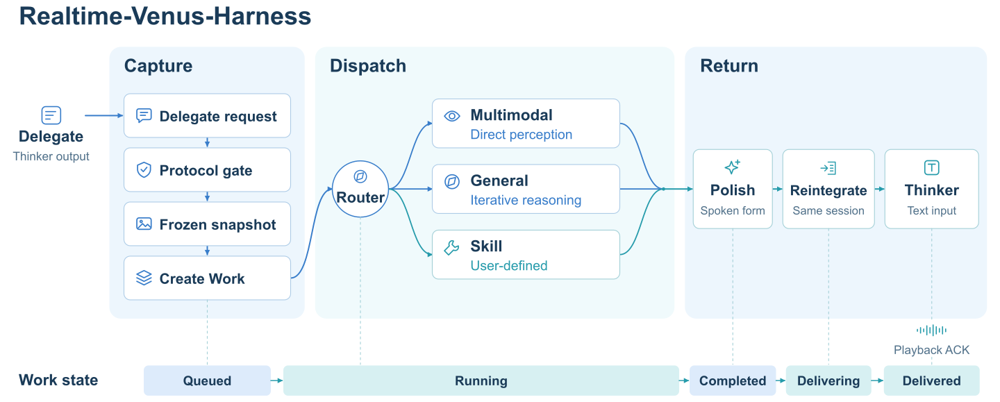

# Realtime-Venus-Harness

**English** · [简体中文](README_ZH.md) · [Project](../README.md) · [Run the Demo](../demos/README.md) · [Paper](https://arxiv.org/html/2609.13814v1#S5)

Harness captures `<delegate>...</delegate>` requests, runs background tasks, and returns results to the same conversation. It tracks task context, execution, progress, cancellation, continuation, and delivery.

## Architecture

<p align="center"><br /><sub>Figure 7 from the <a href="https://arxiv.org/html/2609.13814v1#S5.F7">paper</a>. Work tracking spans Capture, Dispatch, and Return.</sub></p>

### 1. Capture: a request with a stable context

The protocol gate assembles delegate spans across chunks, fixes the evidence cutoff at the opening tag, and registers the completed request with its originating session. Structured tasks can use `DelegateHarness.submit_delegate` or `submit_request` directly.

### 2. Dispatch: select and execute a capability

| Path | Purpose | Implementation |
| --- | --- | --- |
| **Multimodal / direct answer** | Answer using the request's available audio or visual evidence. | [`llm/delegate.py`](llm/delegate.py) |
| **General** | Run a task that requires tools or multiple execution steps; retain progress and generated artifacts. | [`agents/`](agents/), [`jobs/`](jobs/) |
| **Skill** | Execute a registered domain capability with a declared argument contract. | [`skills.py`](skills.py) |

**General mode** sends requests directly to the General executor. **Auto mode** asks the planner to choose a capability or handle progress queries and task continuation. The standalone `PlannerClient` defaults to Auto; the browser Demo selects General by default. Available tools and skills depend on the configured executor and registry.

### 3. Return: prepare a reply for this conversation

Harness prepares a spoken reply, checks delivery eligibility, and removes reserved protocol text. The serving host inserts `<backend>...</backend>` into the originating session at an eligible input boundary; Omni then generates speech.

## Frontend and backend integration

| Boundary | Included integration | How to extend it |
| --- | --- | --- |
| Conversational model | Omni via the Demo's `RemoteOmniServingPort` and HTTP model service. | Implement `VenusOmniServingPort`, or submit structured tasks through `DelegateHarness`. |
| Task execution | Codex through `CodexAgentProvider` and its app-server connection. | Implement `GeneralAgentPort` for another executor. |
| Routing and reply preparation | `CodexPlannerBackend` and `CodexDirectAndPolish`. | Implement `PlannerBackend` or the `DelegateBackend` contract. |
| Client playback | Browser playback in the Demo. | Implement `PlaybackPort` and acknowledge only completed playback. |
| Domain capabilities | `AgentSkill` and `SkillRegistry`. | Register a capability description, validated arguments, and executor. |

## Getting started

### Use Harness in your application

Install the package with Python **3.11 or 3.12**, from the repository root:

```bash
python -m pip install -e .
```

Import the installed package as `harness`. To run the full system, follow the [Demo guide](../demos/README.md).

Supply a [`DelegateBackend`](core/backend.py) implementing `plan`, `execute`, `oralize`, and `aclose`:

```python
from harness.core.backend import DelegateBackend
from harness.core.harness import DelegateHarness

async def request_background_work(backend: DelegateBackend):
    harness = DelegateHarness(backend=backend)
    try:
        await harness.open_session("demo-session")
        work_id = await harness.submit_delegate(
            "demo-session", "Create a CSV of the numbers 1–100 and their squares."
        )
        while True:
            result = await harness.next_delegate_result(
                "demo-session", timeout_s=180
            )
            if result.work_id == work_id and result.status != "pending":
                return work_id, result
    finally:
        await harness.aclose()
```

For Codex backend setup, see [`demos/server/resources.py`](../demos/server/resources.py).

### Connect a streaming model

`VenusOmniAgentHarness` assembles the runtime; `VenusOmniServingHost` connects it to the tokenizer, model serving port, and playback client:

1. Open the host session and validate the model's protocol token IDs.
2. Submit timestamped media through `append_audio` and `append_video_frame`.
3. Use one `next_output` loop to consume raw model output in order and pass permitted speech to playback.
4. Call `begin_backend_turn` at eligible boundaries to admit queued private feedback.
5. Call `acknowledge_playback` only for chunks that have actually finished playing.
6. Close the host session and call `agent.aclose()` when the runtime owner exits.

The working implementation is in [`demos/server/session.py`](../demos/server/session.py). `DelegateParser` provides text parsing.

## Work lifecycle

```text
QUEUED → RUNNING → COMPLETED → DELIVERING → DELIVERED
             └→ FAILED
Cancellation: CANCELLING → CANCELLED
```

| State | Meaning |
| --- | --- |
| `QUEUED` | An accepted task is waiting for execution. |
| `RUNNING` | Routing, execution, or reply preparation is underway. |
| `COMPLETED` | The terminal result and prepared reply are available. |
| `DELIVERING` | Feedback is reserved for admission to the originating conversation. |
| `DELIVERED` | Delivery has completed; for speech-bearing replies, this includes generation completion and acknowledgment of the associated playback. |

Before feedback is returned, Harness checks its freshness and originating session. State definitions and delivery logic are in [`jobs/models.py`](jobs/models.py) and [`bridge/runtime.py`](bridge/runtime.py).
